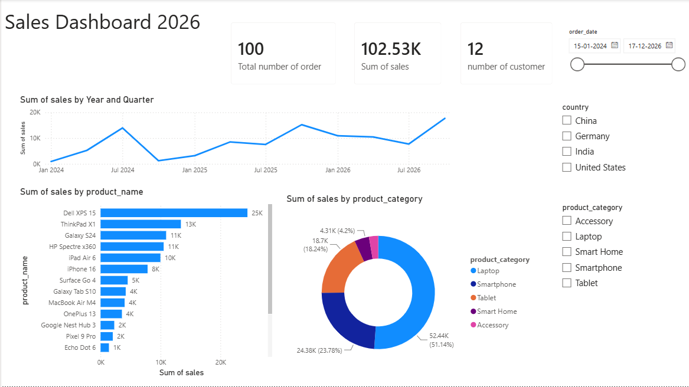

# 📊 Power BI Sales Dashboard Project

## 📝 Overview

This project is an end-to-end Power BI dashboard built to analyze sales data. It demonstrates the complete Power BI workflow, including data cleaning, transformation, data modeling, DAX calculations, and interactive dashboard creation.

---

## 🚀 Key Features

* **Data Cleaning & Preparation**

  * Cleaned and transformed data using Power Query.
  * Merged customer information by combining First Name and Last Name.

* **Data Modeling**

  * Created relationships between the **Customers** and **Orders** tables.
  * Implemented a one-to-many (1:N) data model.

* **DAX Calculations**

  * Created custom measures to analyze sales data.
  * Handled missing (null) values and performed business calculations using DAX.

* **Interactive Dashboard**

  * Sales trend over time (Line Chart)
  * Product category breakdown (Donut Chart)
  * Total Sales
  * Total Orders
  * Total Customers
  * Country Filter
  * Product Category Filter
  * Date Range Filter

---

## 🛠 Tools Used

* Power BI Desktop
* Power Query
* DAX
* CSV Datasets

---

## 🖼 Dashboard Preview

---

## 📂 Repository Files

* `Sales Dashboard.pbix`
* `customers.csv`
* `orders.csv`
* `dashboard.png`

---

## ▶️ How to View

1. Download the **Sales Dashboard.pbix** file.
2. Open it using **Power BI Desktop**.
3. Use the interactive filters and slicers to explore the dashboard.

---

## 👨‍💻 Author

**Rohit Alone**

---
